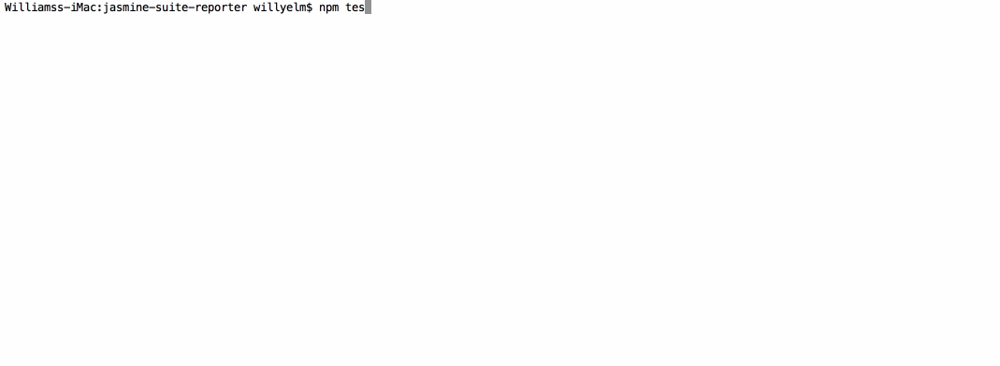

# jasmine-suite-reporter

[](https://www.npmjs.com/package/jasmine-suite-reporter)
[](https://travis-ci.org/willyelm/jasmine-suite-reporter)

A Simple suite spec reporter for Jasmine 2



## Usage

### Installation

Install `jasmine-suite-reporter` using npm:

```sh
npm install jasmine-suite-reporter

```

### Node Implementation

To use the reporter with you node projects simply install and use the
reporter as following:

```javascript
const Jasmine = require('jasmine');
const suiteReporter = require('jasmine-suite-reporter');

var jasmine = new Jasmine();
//Optional override of the default reporter
jasmine.configureDefaultReporter({
  print: function(){}
});
//Register Reporter
jasmine.addReporter(SuiteReporter.create({
  includeStack: true
}));
//load configuration file
jasmine.loadConfigFile('config/file.json');
//Jasmine Start
jasmine.execute();

```

### Protractor Implementation

In your Protractor configuration file:

```javascript

const suiteReporter = require('jasmine-suite-reporter');

exports.config = {
  // your config settings ...
  jasmineNodeOpts: {
    //Remove default dot reporter
    print: function() {}
  },
  onPrepare: function() {
    var jasmineEnv = jasmine.getEnv();
    //Adding custom reporter
    jasmineEnv.addReporter(suiteReporter.create({
      includeStack: true
    }));
  }
};

```


### Karma Implementation

In your karma.conf.js  file:

```javascript

module.exports = function(config){
  config.set({
    // your config settings ...
    reporters: ['suite'],
    plugins: [
      //your plugins...
      'jasmine-suite-reporter/karma'
    ]
  })
};

```
